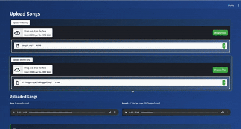

# 🎵 AI-Powered Music Mashup Generator

Create amazing music mashups using artificial intelligence! This tool helps you combine multiple songs into a seamless mashup by analyzing musical elements and finding perfect transition points.





[](/data/output/final_mashup.wav)
 

## ✨ Features

- 🎸 **Intelligent Song Analysis**: Analyzes tempo, key, and musical structure of input songs
- 🔊 **High-Quality Audio Processing**: Process audio with customizable parameters
- 🎯 **Smart Transitions**: Creates seamless transitions between song segments
- 🎼 **Key and Tempo Matching**: Automatically adjusts songs to match in key and tempo
- 🎛️ **Advanced Customization**: Fine-tune EQ, volume, pitch, and crossfade for each segment
- 🎨 **User-Friendly Interface**: Easy-to-use web interface built with Streamlit

## 🚀 Getting Started

### Prerequisites

- Python 3.8 to 3.11
- FFmpeg (for audio processing)

### Installation

1. Clone the repository:
```bash
git clone https://github.com/yourusername/AI_mashup_new.git
cd AI_mashup_generator
```

2. Create and activate a virtual environment:

Using conda:
```bash
conda create -n mashup_ai python=3.9
conda activate mashup_ai
```

Or using venv:
```bash
python -m venv venv
source venv/bin/activate  # On Windows: venv\Scripts\activate
```

3. Install dependencies:
```bash
pip install -r requirements.txt
```

## 💫 Usage

1. Run the application using one of these commands:
```bash
python app.py
```
or
```bash
streamlit run app.py
```

2. Open your browser and go to `http://localhost:8501`

3. Upload songs you want to mashup

4. Use the interface to:
   - Create segments from your songs
   - Adjust audio parameters (volume, pitch, EQ, crossfade)
   - Reorder segments to create your mashup
   - Preview segments before finalizing
   - Generate the final mashup

## 🔧 Project Structure

The project is organized into several key components:

- **core/**: Core functionality modules
  - `audio_processor.py`: Handles audio processing and effects
  - `segment_manager.py`: Manages segment creation and organization
  - `ai_suggestions.py`: Generates AI-powered suggestions
  - `file_handler.py`: Handles file operations

- **ui/**: User interface components
  - Contains the Streamlit interface elements

- **config/**: Configuration settings
  - `settings.py`: Default settings and constants

- **utils/**: Utility functions
  - Includes logging and helper functions

- **static/**: Static assets
  - `custom.css`: Custom styling for the interface

## 🤝 Contributing

Contributions are welcome! Please feel free to submit a pull request.